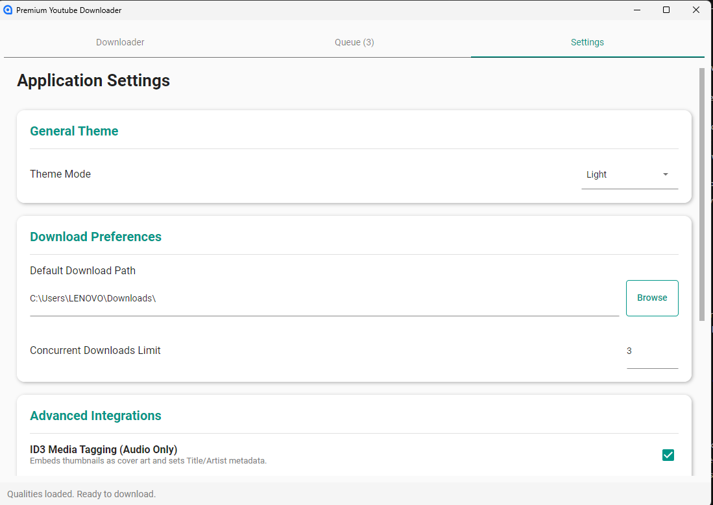
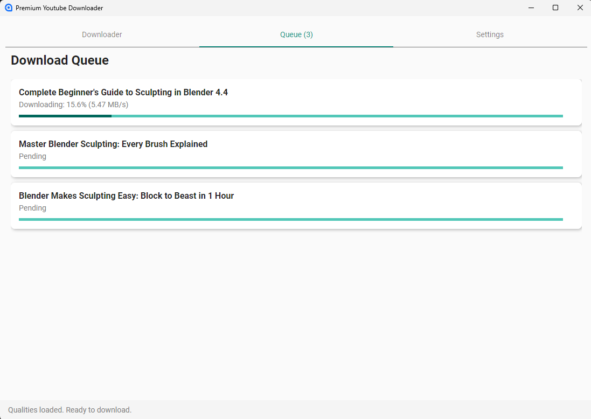
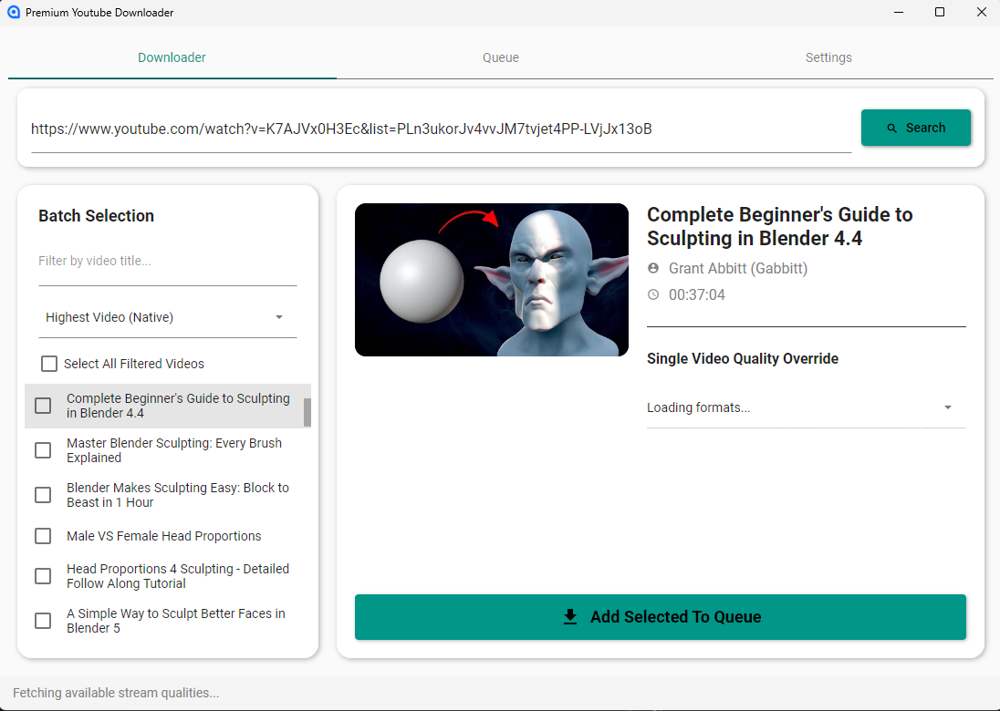
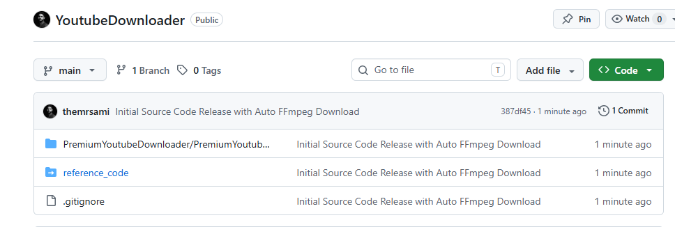

<!-- README.md -->

  
  
  
  
  

  <h1>🚀 Premium YouTube Downloader</h1>
  
<strong>An advanced, lightning-fast desktop application to download YouTube videos, playlists, and channels in maximum quality.</strong>

  
<i>Developed by <b>themrsami</b></i>

## 🌟 Overview

**Premium YouTube Downloader** is a highly optimized, feature-rich desktop application designed for users who demand the highest video quality, advanced FFmpeg integrations, and a sleek, premium User Interface. 

Built with performance in mind, this tool bypasses standard API limitations to deliver blazing-fast multi-threaded downloads, native 4K/8K stream merging, and flawless subtitle embedding—all wrapped in a beautiful modern design.

## ✨ Key Features

- **🔥 Ultra-Fast Multi-Threaded Engine:** Maximize your bandwidth with chunked downloading. Live MB/s speed indicators for every item in your queue.
- **🎥 4K / 8K Native Support:** Automatically merges the highest available separated video and audio streams using an integrated FFmpeg pipeline.
- **📝 Advanced Subtitle Embedding:** Native subtitle downloading (VTT to SRT conversion). Automatically burns multi-language subtitles natively into the MP4 container for instant player recognition.
- **🎨 Premium Dark UI:** A stunning, glassmorphic Avalonia UI with real-time progress bars, thumbnail previews, and granular quality selection.
- **🎶 Audio Extraction:** One-click pristine audio extraction (MP3) with automatic ID3 tagging and album art generation.
- **⚙️ Deep Customization:** Global quality preferences, local overrides, customizable download paths, and more.

## 📸 Screenshots

  
  
   
  
  

## 📥 Installation

You can download the pre-compiled, self-contained Windows portable executable directly from the Releases page, or clone the repository to build from source!

1. Go to the [Releases Tab](../../releases/latest).
2. Download the latest `PremiumYoutubeDownloader.exe`.
3. Double-click to run! (No installation required—it's a portable executable).

## 💡 How to Use

1. **Paste your URL:** Paste a single video or a massive playlist link into the top search bar.
2. **Select Quality:** Use the global dropdown to set your preferred resolution (e.g., 1080p, 4K, Audio Only).
3. **Queue & Download:** Hit "Download" and watch the ultra-fast FFmpeg engine handle the heavy lifting!

## 🛠️ Technology Stack

- **Core Engine:** C# / .NET 8
- **UI Framework:** Avalonia UI (XAML)
- **Video Extraction:** YoutubeExplode
- **Media Processing:** Xabe.FFmpeg

  
Copyright © 2026 themrsami. All Rights Reserved.

